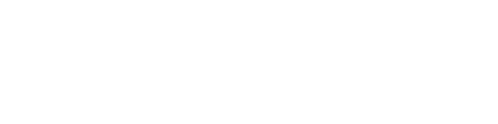

# DroneController
Object Controller using LSL with RayCasting to determine Target Vectors.<br>
Allows a rotating polygon resting pattern that dynamically adapts to the amount of Drones rezzed in the world.

## Setup
| Step | Description |
| - | - |
| 1 | Upload the two LSL files to SL |
| 2 | Create inworld objects for HUD & Drone |
| 3 | Put the DroneController.lsl in the HUD |
| 4 | (Optional) Use the texture or UUID "a75e7ea2-b5cc-37c4-1dde-0d295ee515db" |
| 4 | Place the Drone.lsl in the Drone object |
| 5 | Copy the Drone object into the HUD |
| 6 | Attach & wear the HUD object |

Create a gesture to toggle on & off the DroneController.
- Add chat entry: `/9871 toggle`
- Keybind: `SHIFT + SPACE`

Add a second gesture to detect an agent/target for the Drones.
- Add chat entry: `/9871 trigger` 
- Keybind: `CTRL + SPACE`

## Usage
Enable the DroneController via your gesture hotkey to boot it up.<br>
Use your camera/mouselook and aim at your desired target, followed by activation of the detect gesture.

The HUD hovertext will display the current target position (vector) or object/agent name if possible while in tracking mode.<br>
As for the buttons on the HUD itself, they have the following functions:
- On/Off Toggle
- Switch between default & polygon mode
- Add (Rez) drone
- Remove last drone
- Purge all drones in the simulator

The "Rotation" and "Distance" sections ontop are both sliders.<br>
Left to right equals 0-100% of the ROTATING & DISTANCE params respectively.

## Configuration Parameters
```py
RATE     0.1 # Tick rate for position updates
CHECK    5.0 # Health check interval for drone status
TIMER    2.5 # Time in seconds until reset
RANGE  128.0 # Detection range, 4096m max
HEIGHT   1.5 # Hover height above the owner in meters
DISTANCE 0.2 # Distance between the drones for polygon resting
ROTATING 3.0 # Rotation increments in degrees per tick (set to 0 to disable)
CHANNEL 9871 # Gesture & comms channel for the drones
```

## License
MIT
